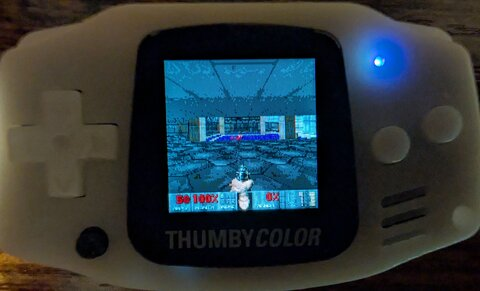
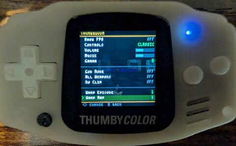

# ThumbyDOOM

> 😈 **ThumbyDOOM is now part of [ThumbyOne](https://github.com/austinio7116/ThumbyOne)** — a unified multi-boot firmware that ships ThumbyDOOM, ThumbyNES (NES / SMS / GG / GB), ThumbyP8 (PICO-8), and MicroPython + Tiny Game Engine in a single UF2. Most users should flash ThumbyOne instead of the standalone ThumbyDOOM firmware below.
>
> This repo remains the standalone build of ThumbyDOOM and the source of truth for the port itself — the code here is what ThumbyOne's DOOM slot compiles. Use this repo if you specifically want DOOM-only firmware, or to hack on the port.

DOOM on the [Thumby Color](https://thumby.us/) — the world's smallest
color gaming handheld.

Full shareware/ultimate DOOM or DOOM II running as standalone bare-metal
firmware on the RP2350. Music, sound effects, save games, screen
melts — rendered natively on a 128x128 screen.

<p align="center">
  
  
</p>

<p align="center">
  <a href="https://www.youtube.com/watch?v=UlLmX9A7Qhs">
    
  </a>
  <br><em>Click to watch the video demo</em>
</p>

## Quick Start

**Warning:** Flashing this firmware **replaces the entire Thumby Color
operating system**. Your existing games, saves, and settings will be
erased. To restore normal functionality afterwards, re-flash the
standard Thumby Color firmware from
[thumby.us](https://color.thumby.us/pages/firmware-and-updating/firmware-and-updating/)
and re-upload your games.

1. Download **`thumbydoom_shareware.uf2`** from this repo
2. Turn off your Thumby Color
3. Hold **DOWN** on the d-pad while turning it on (enters flash mode)
4. Drag the `.uf2` file onto the **RPI-RP2350** USB drive that appears
5. The device reboots and DOOM starts

## How to Play

### Controls

| Button | Action |
|--------|--------|
| D-pad L/R | Turn left / right |
| D-pad U/D | Move forward / back |
| LB | Strafe left |
| RB | Strafe right |
| A | Fire / menu confirm |
| B (tap) | Use / open doors |
| B (hold 0.4s) | Toggle automap |
| B + LB | Previous weapon |
| B + RB | Next weapon |
| MENU | Open Doom menu |
| LB + RB (hold 3s) | Open overlay menu |

### Tips

- **Opening doors**: Walk up to a door and tap **B**
- **Switching weapons**: Hold **B** then tap **LB** (prev) or **RB** (next)
  to cycle through your arsenal. You get new weapons by picking them up.
- **Automap**: Hold **B** for half a second to toggle the map overlay.
  Use the d-pad to look around. Hold **B** again to close it.
- **Saving your game**: Press **MENU** to open the pause menu, select
  "Save Game", then pick a slot. The game saves instantly to flash.
- **Loading a save**: From the pause menu, select "Load Game" and pick
  your slot. This also works from the title screen.
- **Menu navigation**: **A** confirms, **MENU** goes back
- **Secrets**: Doom is full of hidden rooms. Look for walls that are a
  slightly different texture — walk up and tap **B** to open them.

### Status Bar

The bottom of the screen shows your health, armor, ammo, and the
Doomguy's face (which reacts to damage direction). Key cards appear
as colored markers when collected.

### Overlay Menu

<p align="center">
  
</p>

Hold **LB + RB** together for 3 seconds during gameplay to open the
overlay menu. The game pauses and a settings screen appears over the
dimmed game view. Navigate with the **d-pad**, adjust values with
**left/right**, toggle options with **A**, and close with **B** or
**MENU**.

| Option | Type | Description |
|--------|------|-------------|
| Resume | Action | Close menu and unpause |
| Show FPS | Toggle | Display frame rate counter (top-right) |
| Controls | Choice | CLASSIC (d-pad turns, bumpers strafe) or SOUTHPAW (d-pad strafes, bumpers turn) |
| Volume | Slider 0-20 | Master volume (10 = default, 20 = 2x boost) |
| Music | Slider 0-20 | Music volume relative to SFX |
| Gamma | Choice | Brightness correction (OFF, 1-4) |
| God Mode | Toggle | Invincibility |
| All Weapons | Toggle | All weapons, full ammo, all keys |
| No Clip | Toggle | Walk through walls |
| Warp Episode | Choice 1-4 | Select episode for level warp |
| Warp Map | Choice 1-9 | Select map for level warp |
| Warp Now! | Action | Warp to the selected level |
| Battery | Info | Percentage + voltage with progress bar |

## Features

- Native 128x128 rendering (not a downscaled larger frame)
- OPL2 music + 8-channel SFX
- Classic screen melt transitions between levels
- Save/load to flash (6 slots, persists across power cycles)
- Correctly scaled status bar with smooth text (2x2 blend filter)
- Overlay pause menu with cheats, settings, and level warp
- FPS counter, gamma correction, control scheme switching
- DOS-style boot log showing real initialization messages

## Build from Source

### Prerequisites

- `arm-none-eabi-gcc` (Pico SDK cross toolchain)
- Pico SDK (`PICO_SDK_PATH` environment variable)
- `doom1.wad` (shareware) for WHD generation

### One-time: generate the WHD blob

```sh
cmake -B build_host vendor/rp2040-doom -DCMAKE_BUILD_TYPE=Release
cmake --build build_host --target whd_gen -j8
build_host/src/whd_gen/whd_gen /path/to/doom1.wad doom1.whd -no-super-tiny
```

### Device firmware

```sh
cmake -B build_device -S device -DPICO_SDK_PATH=$PICO_SDK_PATH
cmake --build build_device -j8
# Output: build_device/thumbydoom.uf2
```

### Flashing

1. Power off the Thumby Color
2. Hold DOWN on the d-pad while powering on (enters BOOTSEL)
3. Drag `thumbydoom.uf2` onto the RPI-RP2350 USB drive

## Architecture

```
Core 0: Game loop + pd_render (128x128) + LCD present via SPI DMA
Core 1: OPL2 music (emu8950 @ 49716 Hz) + SFX ADPCM → PWM ring buffer
```

| Component | Size | Purpose |
|-----------|------|---------|
| Zone heap | 160 KB | Doom's dynamic allocator |
| list_buffer | ~90 KB | pd_render column data |
| v_overlay_buf | 64 KB | 320x200 overlay staging |
| frame_buffer | 32 KB | 2x 128x128 8-bit indexed |
| g_fb | 32 KB | 128x128 RGB565 LCD buffer |
| Audio ring | 8 KB | PWM sample ring buffer |

### Key compile defines

- `SCREENWIDTH=128 SCREENHEIGHT=128 MAIN_VIEWHEIGHT=112`
- `THUMBY_NATIVE=1` — full pointers (no shortptr encoding)
- `DOOM_TINY=1 DOOM_SMALL=1` — compressed structures
- `PICODOOM_RENDER_NEWHOPE=1` — kilograham's column renderer
- `USE_THINKER_POOL=0` — disabled to work around a 1-byte memory corruption

## Vendor Modifications (rp2040-doom)

The vendored [rp2040-doom](https://github.com/kilograham/rp2040-doom) code
is included directly (not as a submodule) with modifications gated by
`#if THUMBY_NATIVE`. The original project targets the RP2040 (264 KB SRAM)
with a PIO scanvideo display and dual-core rendering pipeline. The Thumby
Color has an RP2350 (520 KB SRAM) with a 128x128 SPI LCD. The following
changes were required:

### Memory model (`doomtype.h`, `z_zone.c`, `d_think.h`)

**Problem:** rp2040-doom uses 16-bit `shortptr_t` with a 256 KB memory
window and pointer encoding (`SHORTPTR_BASE`). This tightly couples the
memory layout to the RP2040's 264 KB SRAM and requires careful linker
script tuning.

**Fix:** On THUMBY_NATIVE, `shortptr_t` is `void*` (full 32-bit pointer).
All encoding/decoding macros become pass-through. The `memblock_t` and
`thinker_t` size assertions are relaxed since the structs are larger with
wider pointers. The non-pool `Z_ThinkMalloc` path is fixed to work with
`NO_Z_MALLOC_USER_PTR` (cast to satisfy C++ compilation).

### Display architecture (`pd_render.cpp`, `v_video.c`, `i_video.h`)

**Problem:** rp2040-doom uses PIO scanvideo with beam-racing on core1.
The display driver generates scanlines on-the-fly from the column render
data. This architecture doesn't apply to an SPI LCD.

**Fix:** Single-core display on core0. The frame is rendered to a
128x128 8-bit indexed double-buffer, palette-converted to RGB565, and
DMA'd to the GC9107 LCD. A 320x200 overlay staging buffer
(`v_overlay_buf`) receives all 2D content (HUD, menus, intermission
text) drawn at vanilla Doom's coordinate space. The overlay is
downsampled to 128x128 with a 2x2 box-filter blend for smooth text,
using a split Y-mapping during gameplay so the 32-row STBAR maps to
exactly 16 native rows at correct aspect ratio.

Key details:
- `V_ClearOverlay()` runs at the start of each frame
- `V_CompositeOverlay` replaced with RGB565 blend in `present_frame()`
- `vpatch_clip_bottom` restored to 200 before overlay drawing (was
  being left at 128 by `draw_framebuffer_patches_fullscreen`, clipping
  the STBAR and lower intermission text)
- Splash screens draw to full SCREENHEIGHT (not just MAIN_VIEWHEIGHT)
- `draw_stbar_on_framebuffer()` simplified for single-buffer architecture
- All core1 semaphore handshaking removed from the display path
- `pd_start_save_pause` / `pd_end_save_pause` simplified (no semaphore
  dance with a non-existent core1 display loop)

### Resolution scaling (`r_main.c`, `r_things.c`)

**Problem:** Weapon sprites (psprites) are designed for 320-pixel width.
The view scaling code assumes 320-pixel base units. At 128 pixels, weapons
appear at wrong positions and sizes.

**Fix:**
- `pspritescale = FRACUNIT * viewwidth / 320` (scale relative to vanilla
  width, not native width)
- Weapon X centering uses vanilla half-width (160) not native half (64)
- `BASEYCENTER = 57` tuned for the 0.4x vertical scale so the weapon
  sits at the correct screen position
- `scaledviewwidth` computed from actual SCREENWIDTH instead of
  hardcoded 320-pixel multiples

### Screen transitions (`d_main.c`, `f_wipe.h`)

**Problem:** rp2040-doom's wipe effect uses PIO scanline beam-racing with
per-column Y offsets computed on core1. The classic Doom wipe
(`f_wipe.c`) requires `!DOOM_TINY` which is incompatible with the
compressed data structures.

**Fix:** Custom melt wipe implemented at the RGB565 framebuffer level in
`i_video_thumby.c`. Snapshots `g_fb` on state change, then composites
old-screen columns sliding down using the classic random-walk
acceleration curve. The game keeps ticking during the melt so audio and
game state progress naturally. The wipe state machine in pd_render is
killed (`wipestate = 0`) to prevent interference.

### Save system (`m_menu.c`, `pd_render.cpp`)

**Problem:** The save dialog expects keyboard text input for slot names.
The save-pause mechanism uses semaphore handshaking with core1's display
loop. Flash writes need core1 paused (it executes code from flash).

**Fix:**
- `M_SaveSelect` auto-fills "SAVE N" and saves immediately on
  THUMBY_NATIVE (no text entry)
- `pd_start_save_pause` / `pd_end_save_pause` skip the semaphore
  protocol (single-core display)
- `picoflash_sector_program` uses `flash_safe_execute()` from the
  Pico SDK which handles multicore lockout via NMI, safely pausing
  core1 during flash erase/program

### Input (`i_input_thumby.c`)

**Problem:** Doom expects a keyboard with number keys (weapon select),
Tab (automap), and text entry. The Thumby Color has 9 buttons.

**Fix:**
- D-pad L/R = turn, U/D = forward/back
- LB/RB = strafe left/right
- A = fire + menu confirm, B = use + yes
- Long-press B = automap toggle (KEY_TAB)
- B + LB = previous weapon, B + RB = next weapon
- MENU = ESC
- `key_prevweapon` / `key_nextweapon` bound at runtime since
  `I_InitInput` is never called by the engine

### Audio (`i_picosound_thumby.c`, `opl_thumby.c`)

**Problem:** rp2040-doom uses I2S audio output. The Thumby Color has a
PWM amplifier on GPIO 23.

**Fix:** Core1 runs a tight loop mixing OPL2 music (emu8950 at 49716 Hz,
downsampled to 22050 Hz) with 8-channel ADPCM SFX into a 10-bit PWM DAC
via a ring buffer. Mixing uses int32 accumulators with proper clamping to
prevent overflow distortion. `multicore_lockout_victim_init()` on core1
enables NMI-based pause for safe flash writes during save.

### Boot sequence (`doom_device_main.c`)

DOS-style boot log: a `stdio_driver_t` captures `printf` output during
init and renders each line to the LCD with a mini font. Red header bar
with version, grey text scrolling as subsystems initialize. Disabled
automatically when `D_DoomLoop` starts.

### Crash diagnostics (`doom_device_main.c`)

- HardFault handler: red screen with faulting PC and LR (look up in
  `.dis` file)
- DWT hardware watchpoint infrastructure for memory corruption debugging
- Blue diagnostic screen (`thumby_crash()`) callable from validation
  traps anywhere in the codebase

## Changelog

### v1.2.1

- **Battery indicator** in overlay menu — shows percentage, voltage,
  and green/grey progress bar. ADC warmed up at boot for accurate
  first read (RP2350 pipeline fix from ThumbyNES).

### v1.2

- **Audio: native 49716 Hz output** — mixer now runs at the OPL2's
  native sample rate, eliminating the 49716→22050 Hz downsample
  entirely. Zero resampling aliasing, zero interpolation artifacts.
  The cleanest possible OPL music reproduction.
- **Audio: 12-bit PWM DAC** — upgraded from 10-bit (1024) to 12-bit
  (4096 wrap). 4x lower quantization noise floor.
- **Audio: triangular dither** — decorrelates quantization noise into
  white noise instead of metallic shimmer on sustained tones.
- **Audio: SFX pitch fix** — SFX step calculation was using the OPL
  native rate (49716) instead of the actual output rate. Sound effects
  were playing at roughly half their correct speed and pitch.
- **Audio: optimized SFX low-pass** — filter coefficient loosened
  (1.5:1 ratio, ~85% new sample weight) for crisper gunshots and
  explosions without muffling.
- **Settings persistence** — FPS, controls, volume, music, and gamma
  settings now persist across power cycles via save game slot 7.
- **Host build** — doom_font linked for host SDL build, enabling
  FPS counter and ammo display testing without device.

### v1.1

- **Overlay menu**: Hold LB+RB for 3 seconds to open an in-game
  settings overlay with FPS counter, control scheme, volume/music
  sliders, gamma correction, cheats (god mode, all weapons, no clip),
  and level warp
- **Audio quality**: 16-bit ADPCM decode (was truncated to 8-bit),
  gentler low-pass filter for crisper SFX, linear interpolation for
  music downsampling
- **Gamma correction**: Palette rebuild now applies the Doom gamma
  table — 5 brightness levels (OFF, 1-4)
- **Weapon switching**: B+LB = previous weapon, B+RB = next weapon
- **Intermission screen**: Stats text positioned correctly using
  320x200 overlay coordinates instead of native 128x128
- **HUD fix**: vpatch_clip_bottom restored to 200 before overlay
  drawing — fixes missing HUD on level 2+ and clipped intermission
  text
- **Control scheme**: Classic (d-pad turns) or Southpaw (d-pad
  strafes) selectable from the overlay menu
- **Volume control**: Master volume and music volume sliders (0-20,
  where 10 = default, 20 = 2x boost)
- **Build script**: `build_wad.sh` for building firmware from any
  supported WAD (Ultimate Doom, Doom II)

### v1.0

- Initial release
- Full shareware Episode 1 playable
- Native 128x128 rendering via pd_render
- OPL2 music + 8-channel SFX on core1
- Classic screen melt wipe transitions
- Save/load to flash (6 slots)
- 16-row status bar with 2x2 blend filter
- Automap (long-press B)
- DOS-style boot log
- HardFault handler for crash diagnostics

## Credits

- [Id Software](https://www.idsoftware.com/) — DOOM (GPLv2)
- [Chocolate Doom](https://www.chocolate-doom.org/) — clean Doom source port
- [kilograham/rp2040-doom](https://github.com/kilograham/rp2040-doom) — RP2040 port with pd_render
- [TinyCircuits](https://tinycircuits.com/) — Thumby Color hardware

## License

GPLv2. See `vendor/rp2040-doom/COPYING.md`.

The shareware WAD is distributed under Id Software's original terms.
Only the pre-processed WHD blob is embedded in firmware built locally
from a copy of the shareware WAD the user already possesses.
